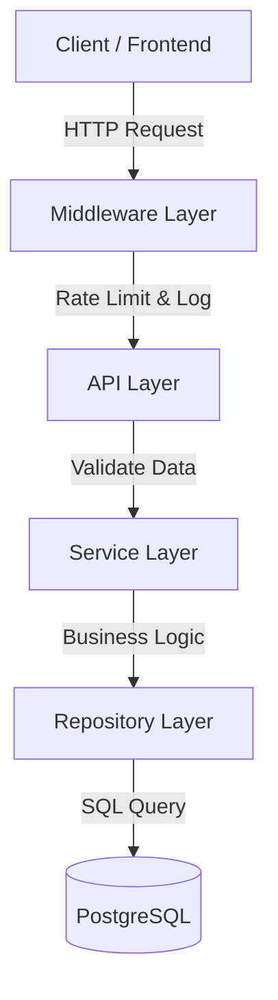

<div align="center">


# SENTINEL AUTH

### Shielding Your Digital Ecosystem
**Next-Gen Centralized Identity & Access Control microservice**


</div>

---

## 📂 Overview

**SentinelAuth** is a production-grade, high-performance authentication architecture designed to provide military-grade security without compromising developer experience. 

Unlike traditional auth solutions that are tightly coupled to the application logic, SentinelAuth operates as a dedicated **Identity Microservice**. It handles the heavy lifting of encryption, token rotation, and permission enforcement, allowing your main application to focus on business logic. It features a complete **Admin Dashboard**, **Real-time Request Logging**, and **Rate Limiting** out of the box.

---

## 🌟 Key Features

*   **🛡️ Ironclad Security**: Implementation of **OAuth2** with Password Flow and **Bcrypt** hashing.
*   **🔄 Smart Token Rotation**: Auto-rotating Refresh Tokens with revocation capability to prevent session hijacking.
*   **⚡ High-Performance Rate Limiting**: Built-in **Token Bucket Middleware** (100 req/min) to shield against DDoS and brute-force attacks.
*   **📡 Deep Observability**: Zero-latency **Async Request Logging** to PostgreSQL. Every request is tracked, timed, and audited.
*   **👑 RBAC Architecture**: Granular **Role-Based Access Control** (Admin, User, etc.) baked into the core.
*   **🖥️ Admin Control Center**: Integrated **SQLAdmin Dashboard** (`/admin`) for managing users, roles, and inspecting logs visually.
*   **🐳 Docker Orchestration**: One-click deployment with **Docker Compose**.

---

## 🏗️ Architecture

SentinelAuth follows a **Strict Layered Architecture** to ensure maintainability and scalability:



*   **Middleware**: Handles cross-cutting concerns (CORS, Logging, Rate Limiting).
*   **API**: RESTful endpoints using FastAPI.
*   **Service**: Pure business logic and decision making.
*   **Repository**: Data access patterns to abstract the Database.

---

## 🚀 Quick Start

### Option 1: Docker (Recommended)

Run the entire stack (App + DB) in seconds.

```bash
# 1. Start the stack
docker-compose up --build
```

**Access Points:**
*   **API Docs**: [http://localhost:8000/docs](http://localhost:8000/docs)
*   **Dashboard**: [http://localhost:8000/admin](http://localhost:8000/admin)

### Option 2: Local Development

```bash
# 1. Create Virtual Env
python -m venv venv
source venv/bin/activate  # or venv\Scripts\activate

# 2. Install Dependencies
pip install -r requirements.txt

# 3. Configure Env
cp .env.example .env
# Edit .env to set DATABASE_URL=postgresql://...

# 4. Run Migrations
alembic upgrade head

# 5. Ignite Server
uvicorn app.main:app --reload
```

---

## 📂 Project Structure

```bash
SentinelAuth/
├── 📁 app/
│   ├── 📁 api/           # API Routes (Auth, Users)
│   ├── 📁 core/          # Security & Config
│   ├── 📁 db/            # Models & Database Session
│   ├── 📁 middlewares/   # RateLimit & RequestLogger
│   ├── 📁 repositories/  # Database Access Layer
│   └── 📁 services/      # Business Logic Layer
├── 📁 alembic/           # Database Migrations
├── 📄 docker-compose.yml # Container Config
└── 📄 Dockerfile         # App Container
```

---

## 🔒 Security Specs

| Feature | Implementation |
| :--- | :--- |
| **Password Storage** | Bcrypt (Salted & Hashed) |
| **Access Tokens** | JWT (Short-lived: 15min) |
| **Refresh Tokens** | Database-backed (Revocable, 7 days) |
| **API Protection** | Rate Limiting + CORS |
| **Audit Trail** | Full Request Logging |

---

<div align="center">

**Built with ❤️ by Shriram Rajat**

</div>
